# 📊 DEV PATEL
### **Data Analyst · ML Analytics · Full-Stack Web Developer**
#### **Power BI · SQL · Python · PHP · JavaScript · Machine Learning**

 

<!-- HERO SVG BANNER (Responsive & Auto Theme Switching) -->
<a href="https://github.com/Devpatel3003">
  <picture>
    <source media="(prefers-color-scheme: dark)" srcset="./dark.svg">
    <source media="(prefers-color-scheme: light)" srcset="./light.svg">
    
  </picture>
</a>

  

<!-- TOP STATUS BADGES -->

&nbsp;

&nbsp;

&nbsp;

 

---

### ⚡ Quick Telemetry Overview

<table width="100%">
  <tr>
    <td width="25%" align="center">
      <h4>🎓 Academic Excellence</h4>
      <b>9.00 / 10.00 CGPA</b> 
      B.Tech Computer Engineering
    </td>
    <td width="25%" align="center">
      <h4>💼 Total Experience</h4>
      <b>1+ Years Hands-On</b> 
      Data Analytics &amp; Web Eng
    </td>
    <td width="25%" align="center">
      <h4>🤖 ML Benchmarks</h4>
      <b>87.1% Accuracy</b> 
      Predictive Risk Modeling
    </td>
    <td width="25%" align="center">
      <h4>🌐 Full-Stack &amp; BI</h4>
      <b>Power BI · SQL · Web</b> 
      PHP · JS · Python · MySQL
    </td>
  </tr>
</table>

---

## 🧭 About Me &amp; Philosophy

> *"Bridging the gap between robust Full-Stack Web Development, Data Analytics, and Machine Learning to deliver intelligent, end-to-end data systems."*

I am a **Data Analyst, ML Analytics Explorer &amp; Full-Stack Web Developer** with a solid foundation in computer engineering. I specialize in building executive **Power BI dashboards**, engineering performant **SQL / MySQL data pipelines**, developing full-stack web applications with **PHP, JavaScript, AJAX, Bootstrap &amp; HTML/CSS**, and training **Machine Learning models** in Python.

- 🎯 **Data &amp; BI Focus**: Designing interactive **Power BI dashboards**, authoring **DAX measures**, and performing **Exploratory Data Analysis (EDA)**.
- 🌐 **Full-Stack Development**: Crafting dynamic responsive web platforms with **PHP, JavaScript, AJAX, Bootstrap, HTML5, CSS3**, and **MySQL**.
- 🤖 **Predictive Modeling**: Building and evaluating classification algorithms (**Random Forest, Logistic Regression, Decision Trees**) with **Scikit-Learn** and **Streamlit**.

---

## 🛠️ Technical Arsenal &amp; Tools

### 📊 Business Intelligence &amp; Analytics

 

### 🌐 Full-Stack Web Development

 

### 🗄️ Databases &amp; Querying

 

### 🐍 Python, Data Science &amp; Machine Learning

---

## 💼 Professional Experience

<table width="100%">
  <tr>
    <td width="50%" valign="top">
      <h3>📈 Data Analyst Intern</h3>
      <b>Maxgen Technologies</b> · <i>Ahmedabad, India</i> 
      📅 <b>Feb 2026 – Jul 2026</b> · 📍 On-site
        
      <ul>
        <li><b>Power BI Dashboards</b>: Built interactive dashboards with KPIs, custom filters, and drill-downs to communicate key business insights.</li>
        <li><b>Data Transformation</b>: Collected, cleaned, and transformed datasets using <b>Excel, SQL, and Python</b> for reporting.</li>
        <li><b>SQL Engineering</b>: Wrote complex SQL queries to extract, filter, aggregate, and manipulate data from <b>MySQL</b> databases.</li>
        <li><b>Exploratory Analysis (EDA)</b>: Performed EDA to identify trends, patterns, correlations, and data quality issues.</li>
        <li><b>AI Acceleration</b>: Utilized ChatGPT &amp; Gemini for SQL query optimization, analysis, and automated reporting workflows.</li>
      </ul>
      <b>Technologies</b>: <code>Power BI</code> · <code>SQL</code> · <code>MySQL</code> · <code>Python (Pandas, NumPy, Matplotlib)</code> · <code>Excel</code>
    </td>
    <td width="50%" valign="top">
      <h3>💻 Web Developer (Full-Stack)</h3>
      <b>IV Infotech</b> · <i>Mehsana, India</i> 
      📅 <b>May 2024 – Jun 2025</b> · 📍 On-site
        
      <ul>
        <li><b>Full-Stack Architecture</b>: Developed and maintained responsive web applications utilizing <b>HTML, CSS, JavaScript, AJAX, PHP, and Bootstrap</b>.</li>
        <li><b>Asynchronous Data Flow</b>: Implemented <b>AJAX</b> calls for seamless asynchronous server communication without page reloads.</li>
        <li><b>Database Integration</b>: Managed application data using <b>MySQL databases</b>, authoring optimized queries for extraction and analysis.</li>
        <li><b>Data Cleaning &amp; Validation</b>: Executed rigorous frontend &amp; backend data validation, normalization, and optimization routines.</li>
        <li><b>Internal Dashboards</b>: Built interactive internal dashboards and performance tracking reports for business operations.</li>
      </ul>
      <b>Technologies</b>: <code>HTML5</code> · <code>CSS3</code> · <code>JavaScript</code> · <code>AJAX</code> · <code>PHP</code> · <code>Bootstrap</code> · <code>MySQL</code> · <code>Excel</code>
    </td>
  </tr>
</table>

---

## 🚀 Featured Showcase Projects

<table width="100%">
  <!-- Project 1 -->
  <tr>
    <td width="100%">
      

        <h3>🤖 <a href="https://github.com/Devpatel3003">Employee Attrition Prediction &amp; HR Analytics System</a></h3>
      

      
<b>End-to-end predictive analytics framework and interactive HR intelligence suite.</b>

      <ul>
        <li><b>Dataset &amp; Insights</b>: Analyzed <b>1,470+ employee records</b>, engineered 8 high-impact features, and identified key attrition drivers (e.g. 30.5% turnover rate among Overtime personnel).</li>
        <li><b>Machine Learning</b>: Trained and benchmarked 5 ML classification algorithms (Random Forest, Logistic Regression, Decision Tree), reaching <b>87.1% accuracy</b> in predicting flight risk.</li>
        <li><b>Dual Presentation</b>: Deployed a <b>4-page interactive Power BI dashboard</b> with DAX KPI metrics paired with a <b>Streamlit web app</b> featuring a real-time "What-If" retention simulator.</li>
      </ul>
      

        
        
        
        
        
        
      

    </td>
  </tr>

  <!-- Project 2 -->
  <tr>
    <td width="100%">
      

        <h3>📱 <a href="https://github.com/Devpatel3003">Mobile Sales Analytics Dashboard</a></h3>
      

      
<b>Executive commercial intelligence dashboard for tracking multi-regional retail performance.</b>

      <ul>
        <li><b>Visual Intelligence</b>: Developed a comprehensive Power BI dashboard monitoring sales transactions, customer sentiment scores, payment gateway preferences, and city-level revenue.</li>
        <li><b>Advanced DAX Measures</b>: Authored custom DAX calculated columns and dynamic time-intelligence measures to enable executive drill-down filtering.</li>
        <li><b>Data Prep</b>: Conducted multi-stage data preprocessing, cleansing, and outlier treatment using Microsoft Excel before dashboard ingestion.</li>
      </ul>
      

        
        
        
        
      

    </td>
  </tr>

  <!-- Project 3 -->
  <tr>
    <td width="100%">
      

        <h3>🎬 <a href="https://github.com/Devpatel3003">Netflix Titles Dataset — Relational SQL Analysis</a></h3>
      

      
<b>Deep-dive exploratory relational database study and content distribution analysis.</b>

      <ul>
        <li><b>SQL Engineering</b>: Executed extensive MySQL queries incorporating aggregations, <code>GROUP BY</code>, ranking window functions, and string tokenization to answer commercial catalog questions.</li>
        <li><b>Relational Normalization</b>: Transformed nested comma-separated country attributes into a distinct relational mapping entity, unlocking precise country-wise content analysis.</li>
        <li><b>Business Insights</b>: Uncovered production trends across genres, release eras, and regional content expansion strategies.</li>
      </ul>
      

        
        
        
        
      

    </td>
  </tr>
</table>

---

## 🎓 Education &amp; Academic Background

<table width="100%">
  <tr>
    <td width="60%">
      <h4>🏛️ Silver Oak University — Ahmedabad, India</h4>
      <b>Bachelor of Technology (B.Tech) in Computer Engineering</b> 
      📅 2021 – 2025
    </td>
    <td width="40%" align="right">
      
    </td>
  </tr>
  <tr>
    <td width="60%">
      <h4>🏫 J.M. Chaudhary School — Mehsana, India</h4>
      <b>Senior Secondary Education (Class XII), GSEB</b> 
      📅 2021
    </td>
    <td width="40%" align="right">
      
    </td>
  </tr>
  <tr>
    <td width="60%">
      <h4>🏫 J.M. Chaudhary School — Mehsana, India</h4>
      <b>Secondary Education (Class X), GSEB</b> 
      📅 2019
    </td>
    <td width="40%" align="right">
      
    </td>
  </tr>
</table>

---

## 📬 Connect &amp; Collaborate

**Interested in collaborating on Data Analytics, BI Dashboards, Machine Learning, or Full-Stack Web Development?**

 

&nbsp;&nbsp;

&nbsp;&nbsp;

  

Designed &amp; Maintained by <b>Dev Patel</b> ⚡ Powered by Clean Monospace &amp; SVG Architecture

